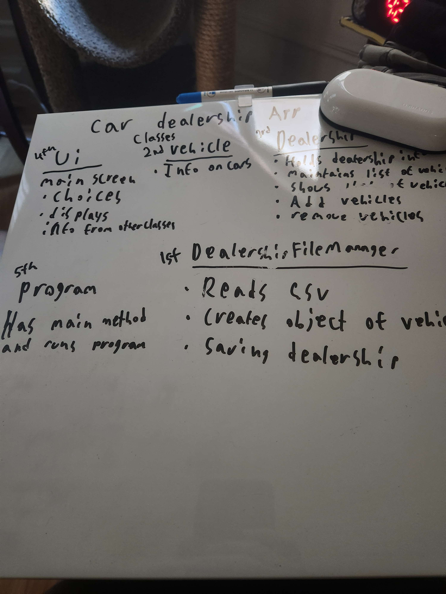
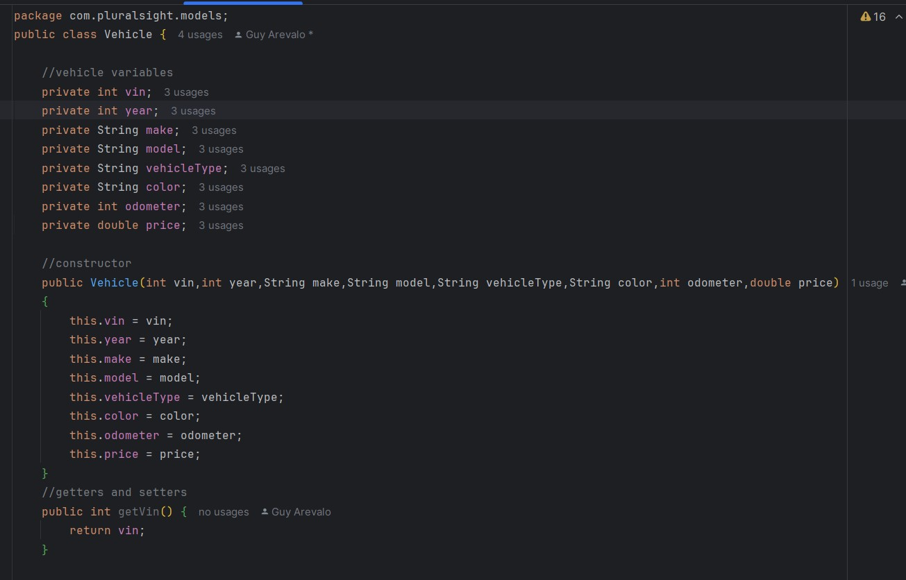
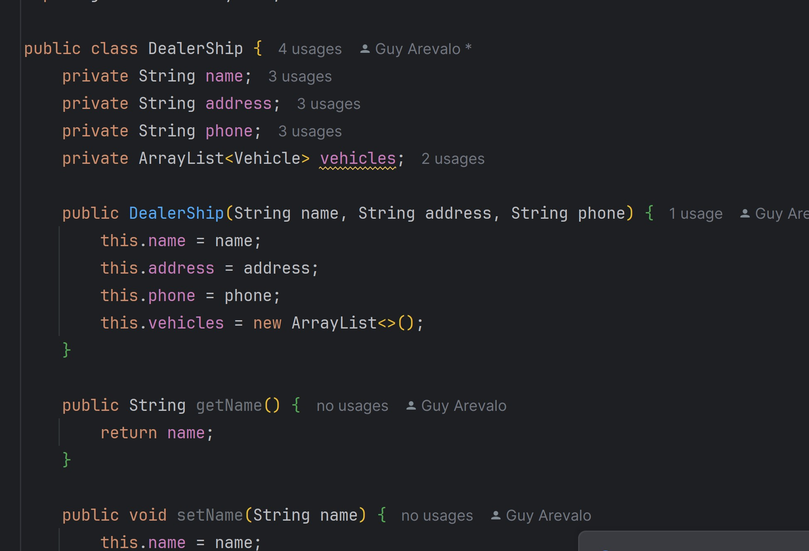
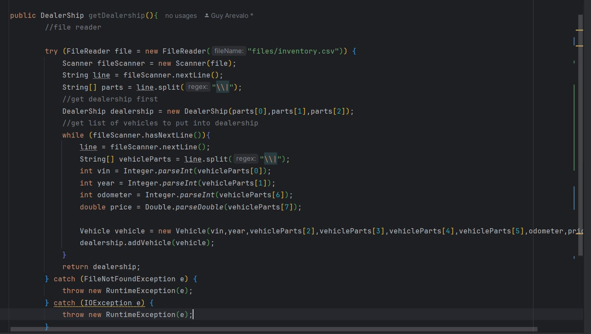
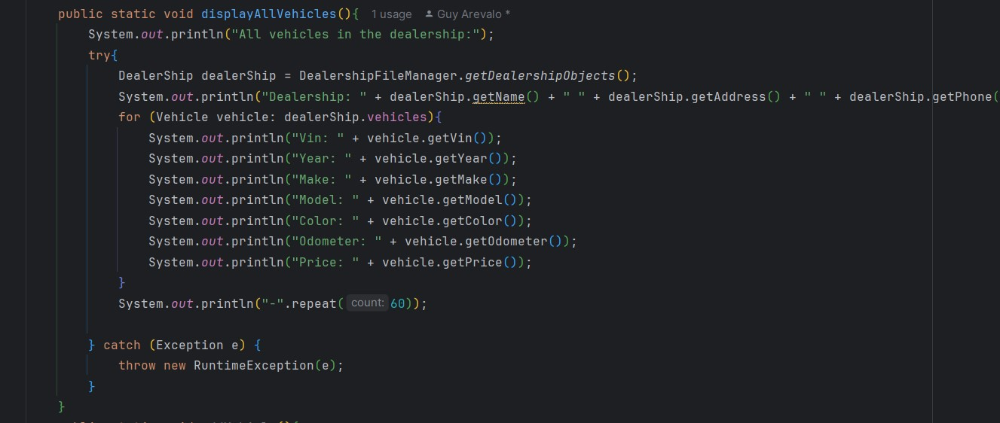

# Car-Dealership-App
A workshop to make a console-based dealership application with straightforward features. It has one Screen(UserInterface class) with 10  options: Find vehicles within a price range(work in progress), Find vehicles by make/model(work in progress),Find vehicles by year range(work in progress), Find vehicles by color(work in progress), Find vehicles by mileage range(work in progress), Find vehicles by type(work in progress), List all vehicles,Add a vehicle(works ,but not as it's meant to), remove a vehicle(work in progress) and exit.

5/9/24
First started off white boarding what classes I needed and where to start. Made the project itself afterwards and created the classes UserInterface, DealersFileManger,Vehicle,Dealership and program. I also added the csv file I would need into the project.

bugs or known issues: N/A

5/10/24
Realized I started working on the wrong class first. That being the DealersFileManger and moved to the Dealship class and vehicle class.
The vehicle class is filled with variables, getters and setters to make well a vehicle(see screenshot below).

The Dealship class at the moment is currently the same as the vehicle class where it's variables, getters and setters. This class is more to make a object for the dealership (see screenshot below).

After setting up both classes I went back to work on the dealshipfilemanger which gets all the information from the csv and puts it into a arraylist (see screenshot below).

I then moved on to set up the main screen that the user when see when first activating the application and setting up the options. Application now runs ,but only goes back to the main screen or exits out of the application.

bugs or known issues: N/A

5/11/24
Began getting some of the Home screen options to start working. Some currently have a "Work in progress". The display all vehicle option currently breaks or gets caught. Still trying to figure that out ,but once that get fixed it should work.

Although I don't have the dealership option setup yet to add a car I currently have the "DealerShipFileManger" class doing it for me. Hoping to eventually move that over since that was one of the objective for the "Dealership" class and not for the "DealerShipFileManger".

bugs or known issues:
-currently gives a error about the dealership name with it saying it's null

5/12/24
Tried adding the addvehicle option and removevehicle option. unforutnaly they don't exactly function as intened yet. Same with trying to test if they work.

bugs or known issues:
-currently gives a error about the dealership name with it saying it's null
-addvehicle dosen't work as inteneded yet
- remove vehicle also does not work.